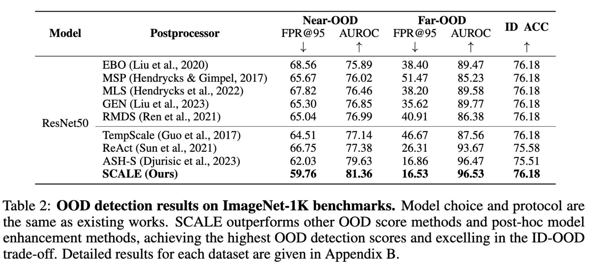
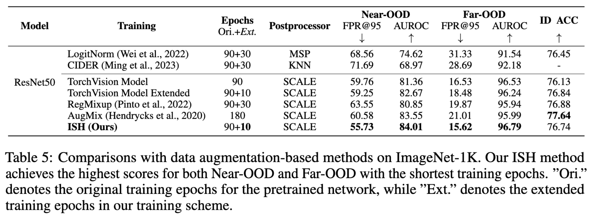

# Scaling for Training Time and Post-hoc Out-of-distribution Detection Enhancement.
This is an offical PyTorch implementation of 


>**Scaling for Training Time and Post-hoc Out-of-distribution Detection Enhancement.**  
[[arXiv]]()       
Kai Xu, Rongyu Chen, Gianni Franchi, Angela Yao 

The capacity of a modern deep learning system to determine if a sample falls within its realm of knowledge is fundamental and important.
In this paper, we offer insights and analyses of recent state-of-the-art out-of-distribution (OOD) detection methods - extremely simple activation shaping (ASH). We demonstrate that activation pruning has a detrimental effect on OOD detection, while activation scaling enhances it.
Moreover, we propose SCALE, a simple yet effective post-hoc network enhancement method for OOD detection, which attains state-of-the-art OOD detection performance without compromising in-distribution (ID) accuracy. By integrating scaling concepts into the training process to capture a sample's ID characteristics, we propose \textbf{I}ntermediate Tensor \textbf{SH}aping (ISH), a lightweight method for training time OOD detection enhancement. We achieve AUROC scores of +1.85\% for near-OOD and +0.74\% for far-OOD datasets on the OpenOOD v1.5 ImageNet-1K benchmark.


### Environment and dataset 
```
pip install -e .
```

Prepare Dataset and pretrained network following [OpenOOD](https://github.com/Jingkang50/OpenOOD) official instruction.
You need to prepare following dataset:
```
python ./scripts/download.py \
	--contents 'datasets' 'checkpoints' \
	--save_dir './data' './results' \
	--dataset_mode 'benchmark'
```
### SCALE as post-hoc model enhancement.

<p align="center">
  
</p>

```
python scripts/eval_ood_imagenet.py \
    --tvs-pretrained \
    --arch resnet50 \
    --postprocessor scale \
    --save-score --save-csv

```

### ISH as training time model enhancement.
<p align="center">
  
</p>

perform inference on ISH model:
```
python scripts/eval_ood_imagenet.py \
  --ckpt-path results/ish/last.ckpt \
  --arch resnet50 \
  --postprocessor scale \
  --save-score --save-csv

```


## Acknowledgment

Our Code is based on [OpenOOD: Benchmarking Generalized OOD Detection](https://github.com/Jingkang50/OpenOOD).

